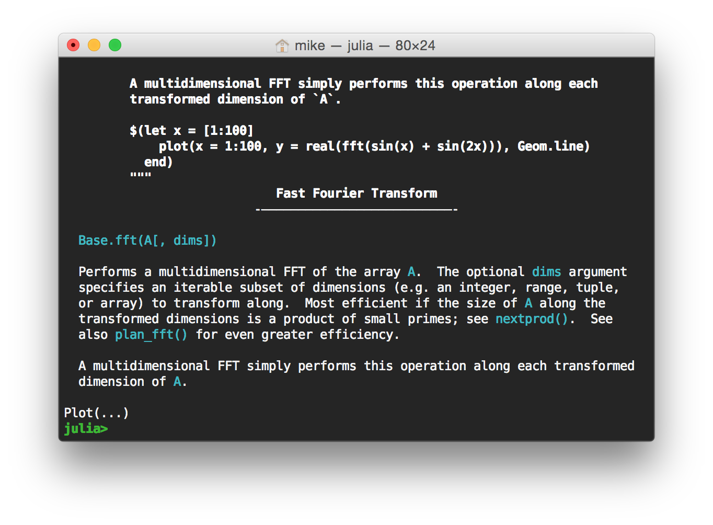
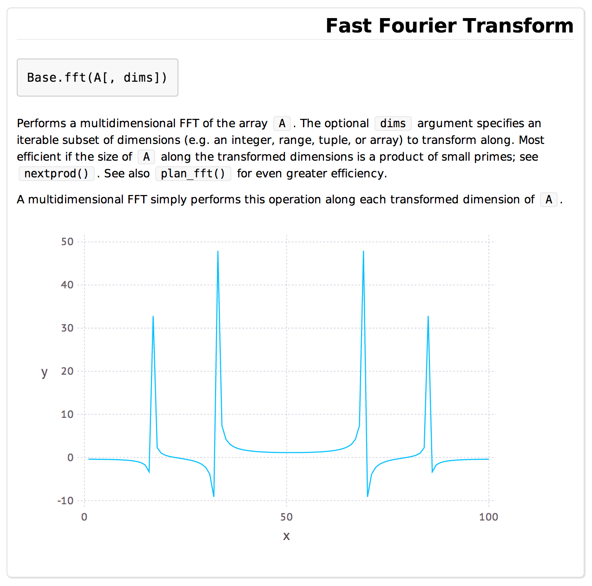

# Markdown

```julia
Markdown.parse_file("file.md")
readme("Markdown") # or any other installed package
```

**Markdown.jl** is a flexible and efficient markdown parser for Julia.
It supports a preliminary implementation of CommonMark as well as GitHub,
IPython and Julia flavoured markdown.

*Note that Markdown.jl lives in Base Julia form 0.4 onwards. PRs and changes should be made over there.*

## Examples

You can construct Markdown by parsing it with `Markdown.parse("...")` or inline with the `md"..."` string macro. The created object will display itself nicely in HTML environments and the terminal.

You can also grab a package's readme with e.g. `readme("Markdown")`.

Say we have a docstring that looks like so:

```julia
md"""
  # Fast Fourier Transform

      Base.fft(A[, dims])

  Performs a multidimensional FFT of the array `A`.  The optional
  `dims` argument specifies an iterable subset of dimensions (e.g.
  an integer, range, tuple, or array) to transform along.  Most
  efficient if the size of `A` along the transformed dimensions is
  a product of small primes; see `nextprod()`.  See also
  `plan_fft()` for even greater efficiency.

  A multidimensional FFT simply performs this operation along each
  transformed dimension of `A`.

  $(let x = [1:100]
      plot(x = 1:100, y = real(fft(sin(x) + sin(2x))), Geom.line)
    end)
  """
```

In the terminal this will render like so:



In Juno (pending CSS updates), like so:



What's that you say? Why yes, I believe it is an interpolated Gadfly plot. Yes, it is indeed interactive. No, this probably won't actually be useful until we standardise on a plotting package in Base, but it's still pretty cool, right?

Incidentally, the interpolation also potentially solves the problem of growing a non-standard Markdown implementation, since anything we need can actually be interpolated as an object with appropriate `writemime` methods defined. I do plan to have Markdown syntax for tables, equations etc. anyway but until then you can always just interp. an `Equation` object of some sort.

So now all we need is syntax highlighting and Mathematica-style ASCII equation rendering in the terminal and we're all set.
